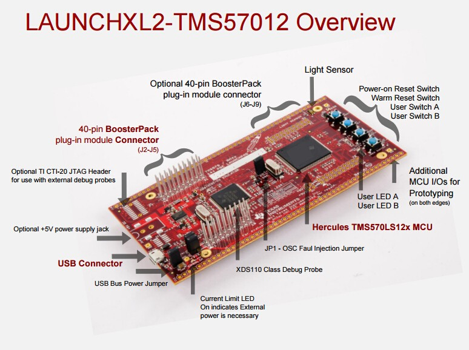
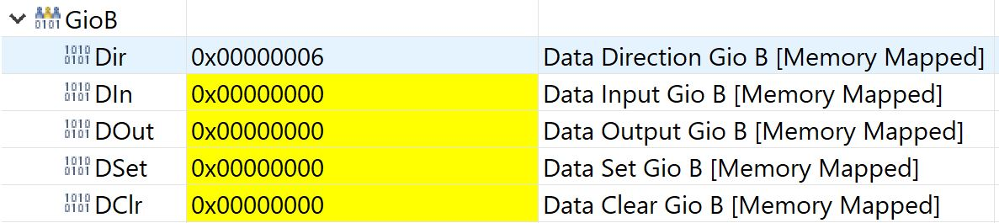
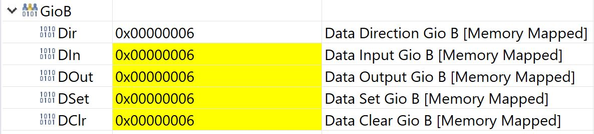
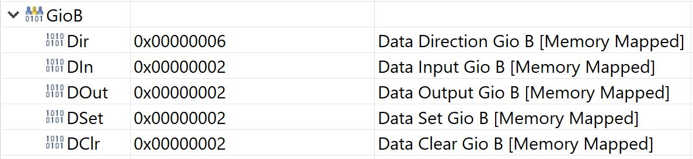
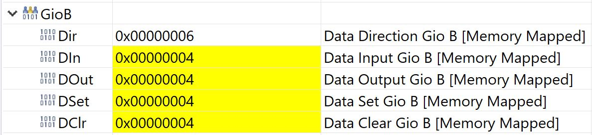
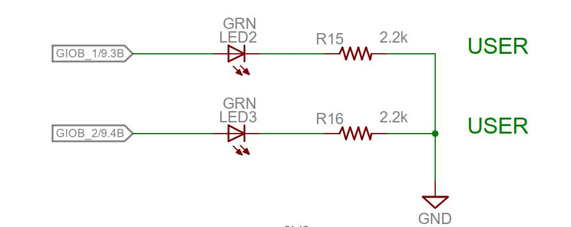
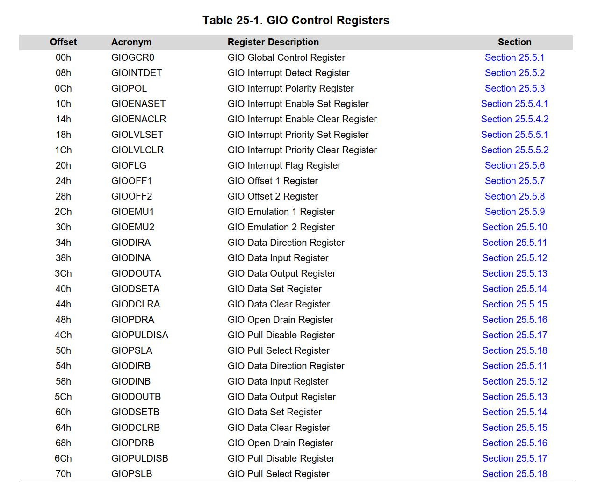

# TMS570LS1224 GIO Driver Lab

## Contents

* [Overview](#Overview)
* [Installations](#Installations)
    * [HALCoGen](#HALCoGen)
    * [Code Composer Studio](#Code-Composer-Studio)
        * [Debugger](#Debugger)
* [GIO Control Registers](#GIO-Control-Registers)
    * [Data Direction Register](GIODIRx)
    * [Data Input Register](GIODINx)
    * [Data Output Register](GIODOUTx)
    * [Data Set Register](GIODSETx)
    * [Data Clear Register](GIODCLRx)
* [Credit](#Credit)

## Overview

A basic <b>General-Purpose Input/Output (GIO) Driver</b> is written in <b>C</b> to toggle the <b>USER LED A</b>
and <b>USER LED B</b> on the <b>TMS5701224 Hercules Launchpad</b> for Safety Microcontrollers. This involved writing functions in which we write to and read from the <b>GIO Control Registers</b> as opposed to using a <b>Hardware Abstraction Layer</b>.

<p align="center"></p>

# HALCoGen

The <b>TI</b> library files were generated using the <b>HALCoGen</b> Graphical Tool Software. Since we intend to write our driver from scratch without the use of a <b>Hardware Abstraction Layer</b>, we disable
The project configuration can be viewed and modified in the [(`GIO_Driver.hcg`)](GIO_Driver.hcg) file.

## Code Composer Studio

<b>Code Composer Studio (CCS)</b> is an <b>Eclipse</b> based <b>IDE</b> to develop applications for <b>Texas Instruments (TI)</b> embedded processors.

We will be using the <b>ARM</b> compiler included with <b>CCS</b> to create our executable.

### Debugger

<b>CCS</b> allows us to use the <b>XDS 110</b> entry level debug probe to step through the code after flashing the program to the microcontroller.

This allows us to view the contents of the registers during runtime and determine if our <b>GIO Driver</b> is working as designed.

Here is a sample of the <b>CCS</b> register displays during runtime.

<b>LED A</b> OFF, <b>LED B</b> OFF | <b>LED A</b> ON, <b>LED B</b> ON
:-------------------------:|:-------------------------:
 |  


<b>LED A</b> ON, <b>LED B</b> OFF | <b>LED A</b> OFF, <b>LED B</b> ON
:-------------------------:|:-------------------------:
  |  

## GIO Control Registers

We locate the <b>GIO</b> port and pins of each of the <b>LED</b>s in the <b>LAUNCHXL2-TMS57012-RM46</b> schematic file, as shown :

<p align="center"></p>

In order to toggle the <b>LED</b> pins, we look up <b>Section 25.5</b> of the <b>TMS570LS1224 Technical Reference Manual</b> to locate the start address of the <b>GIO B</b> module and the offsets of each register, as shown below.

<p align="center"></p>

The <b>Technical Reference Manual</b> also describes what bit fields of each register indicate. This provides us with insight on how to implement our <b>GIO Driver</b> functions in the [(`gio.c`)](source/gio.c) source file.

We use bitmasks to access each bit field, whether for read or write functionality. This is written similar to as in the following code snippet :

```c
if (write == 0b1) port_registers |= 0b1 << pin;
else port_registers &= 0xFFU - 0b0 << pin;
```

### GIODIRx

The <b>Data Direction Register (i.e. GIODIRx)</b> is used to configure each pin of the <b>GIO</b> port <i>x</i> as either an input or output by writing a *0* or *1* to the pin respectively.

We make use of this in our initialization of the <b>GIO Driver</b> as an output peripheral.

### GIODINx

The <b>Data Input Register (i.e. GIODINx)</b> is used to read the current state on the pin of the <b>GIO</b> <i>x</i> port as either an input or output by writing a *0* or *1* to the pin respectively.

### GIODOUTx

The <b>Data Output Register (i.e. GIODOUTx)</b> is used to write to the pin of the <b>GIO</b> port <i>x</i> and specify its output state.

### GIODSETx

The <b>Data Set Register</b> is used to write to the pin of the <b>GIO</b> port <i>x</i> and drive the <b>GIO</b> pin to logic high or *1* by setting the <b>Data Output Control Register (GIODOUTx)</b> bit to *1*. This is done regardless of its current value.

### GIODCLRx

The <b>Data Clear Register</b> is used to write to the pin of the <b>GIO</b> port <i>x</i> and drive the <b>GIO</b> pin to logic low or *0* by clearing the <b>Data Output Control Register (GIODOUTx)</b> bit. This is done regardless of its current value.

<i>Note : The <b>GIO</b> pin must be configured as an output in order for these registers to perform their intended instructions.</i>

## Credit

This <b>GIO Driver</b> was written as a lab for a Firmware Bootcamp for the <b>UBC Orbit Satellite Design Team</b>.